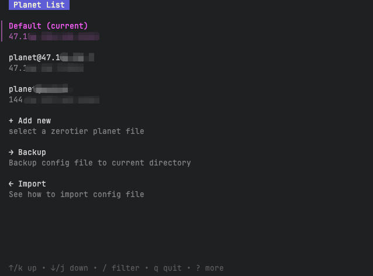
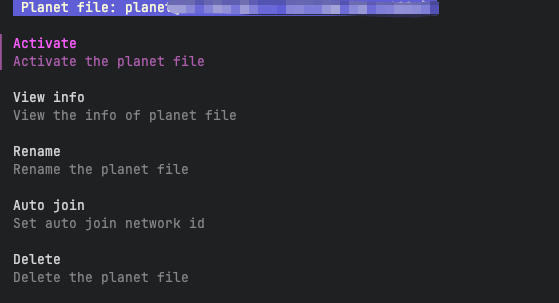

# Zerotier Planet 切换工具

简体中文 | [English](./docs/README_en.md)

一个简易的Zerotier One的Planet文件管理和切换工具，支持Linux/MacOS/Windows(10+)



## 安装
```shell
go install github.com/LanceLRQ/zerotier-switcher@latest
# 使用：
zerotier-switcher
```
或者自行下载并编译

```shell
git clone https://github.com/LanceLRQ/zerotier-switcher
cd zerotier-switcher
go get
go run .
```

## 功能说明

请先安装`Zerotier One`软件，否则程序无法使用。如果要使用planet切换功能，请使用管理员(root)身份运行本程序。

### `planet`列表

在初次启动时，会先去`Zerotier One`默认安装目录下寻找对应的planet文件并装载到列表。

你可以选择对应的planet文件进行操作



#### `Activate` 

使用所选的planet文件替换当前`Zerotier One`的planet文件，并加入到指定网络（如果有设置）

#### `View info` 

展示当前planet文件的解析信息

#### `Rename` 

给当前planet重命名，仅列表显示用

#### `Auto join`

设置自动加入的网路ID

#### `Delete`

从列表中删除planet文件，注意，您无法删除当前正在使用的planet，如果列表只剩一个项目了，也无法删除。