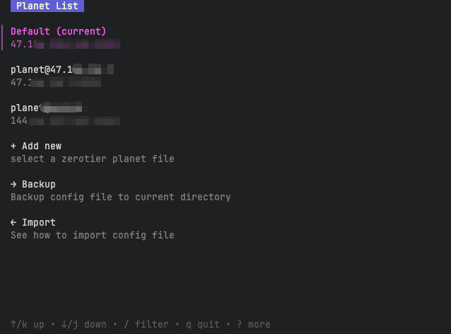
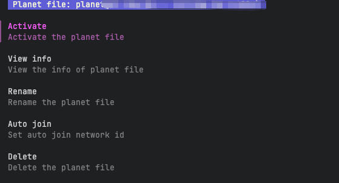

# Zerotier Planet Switcher Tool

[简体中文](../README.md) | English

A simple tool for managing and switching Planet files for Zerotier One, compatible with Linux, macOS, and Windows (10+).



## Installation
```shell
go install https://github.com/LanceLRQ/zerotier-switcher
```
Alternatively, download and compile it manually:

```shell
git clone https://github.com/LanceLRQ/zerotier-switcher
cd zerotier-switcher
go get
go run .
```

## Features

Ensure `Zerotier One` is installed before using this tool. Administrator (root) privileges are required for Planet file switching.

### Planet List

On the first launch, the program will search for Planet files in the default `Zerotier One` installation directory and load them into the list.

You can select a Planet file to perform operations.



#### `Activate`

Replace the current `Zerotier One` Planet file with the selected one and join the specified network (if configured).

#### `View Info`

Display parsed information about the current Planet file.

#### `Rename`

Rename the current Planet file (for display purposes only).

#### `Auto Join`

Set the Network ID for automatic joining.

#### `Delete`

Remove the Planet file from the list. Note: You cannot delete the currently active Planet file or the last remaining item in the list.
